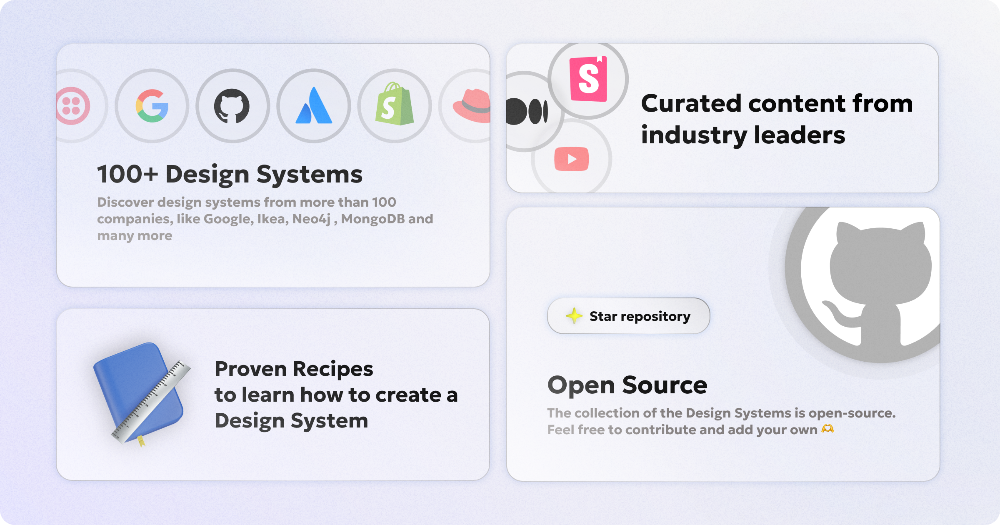
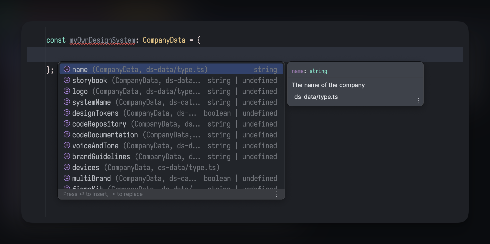

<h1 align="center">Design System Cookbooks 📚 </h1>

<picture>
  <source media="(prefers-color-scheme: dark)" srcset="assets/banner-dark.png">
  <source media="(prefers-color-scheme: light)" srcset="assets/banner-light.png">
  
</picture>

# Table of Contents

- [Introduction](#introduction)
- [How to use](#how-to-use)
- [Contribution](#contribution)
- [Contributors](#contributors)
- [Why Design System Cookbooks?](#why-design-system-cookbooks)
- [Acknowledgements](#acknowledgements)

## Introduction

Welcome to **Design System Cookbooks**, an open-source database of public design systems. This project caters to designers, product managers, and engineers, providing a platform to find and share valuable design resources.

Design System Cookbooks is more than a repository—it's a community-driven guidebook. By pooling together diverse design systems, we aim to create a central, accessible hub where professionals can learn, get inspired, and improve their own design practices.

# How to use

Browse and compare design systems [through our website](https://designsystemcookbooks.com/).

Contribute by adding new systems or updating existing entries.

# Contribution

Your contributions are what makes Design System Cookbooks a valuable resource. Whether you're adding a new system, or updating an existing one, your input is invaluable.

There are two ways to contribute:
1. <u>If you know how to code</u> and want to add a design system, follow the steps below and open a PR.
2. <u>If you don't know how to code</u>, [open an issue](https://github.com/Design-System-Cookbooks/design-systems/issues/new/choose) with the design system you want to add.

For the folks that are adding a design system through a Pull Request, follow the steps below:

1. Clone the repository
2. Run `yarn install` to install dependencies
3. Open the project with your favourite IDE and go to the `src/data.ts` file. There you will find an array of objects with the design systems.
4. Create a design system entry and add it to the final array at the end of the file. Everything is type-safe, and you will have auto-complete on the fields that you can add.

5. If you want to validate that everything is set correctly, run `yarn dev` to visit a simple website locally, at [http://localhost:5173/](http://localhost:5173/). You will see your design system added to the list.
6. Once you are happy with your changes, open a PR. Be sure to add yourself in the contributors list 🫡

# Contributors

Feel free to add yourself here if you have contributed to this project 🙏

* Costa Alexoglou - [Twitter](https://twitter.com/costasAlexoglou/), [GitHub](https://github.com/konsalex/)
* Nouman Tariq - [Twitter](https://twitter.com/numantariq/), [GitHub](https://github.com/numantariq/)
* Ondřej Konečný - [Twitter](https://twitter.com/ondrejkonec), [GitHub](https://github.com/ondrejkonec)
* John Raptis - [Twitter/X](https://twitter.com/JohnRaptisM), [Github](https://github.com/raptisj)
* Phillip Lovelace - [Threads](https://www.threads.net/@pixelflips), [Github](https://github.com/pixelflips)
* You 🫵

# Why Design System Cookbooks?

This project was born from a desire to centralize and democratize design system knowledge, making it accessible to all. Our goal is to provide a platform for designers, product managers, and engineers to share their recipes (thus the `cookbooks` in the name) and learn from others.

> Also, as Adele was acquired alongside UXPin in 2020, the velocity in which they added new design systems dropped dramatically, while the space is growing faster than ever 📈

# Acknowledgements

1. Special thanks to the UXPin team, and the contributors of the [Adele](https://github.com/UXPin/adele) project, which inspired this endeavor. Their commitment to the design community paved the way for projects like ours.
2. [Clearbit](https://clearbit.com/) for the awesome API that we use to fetch the logos of the design systems.
